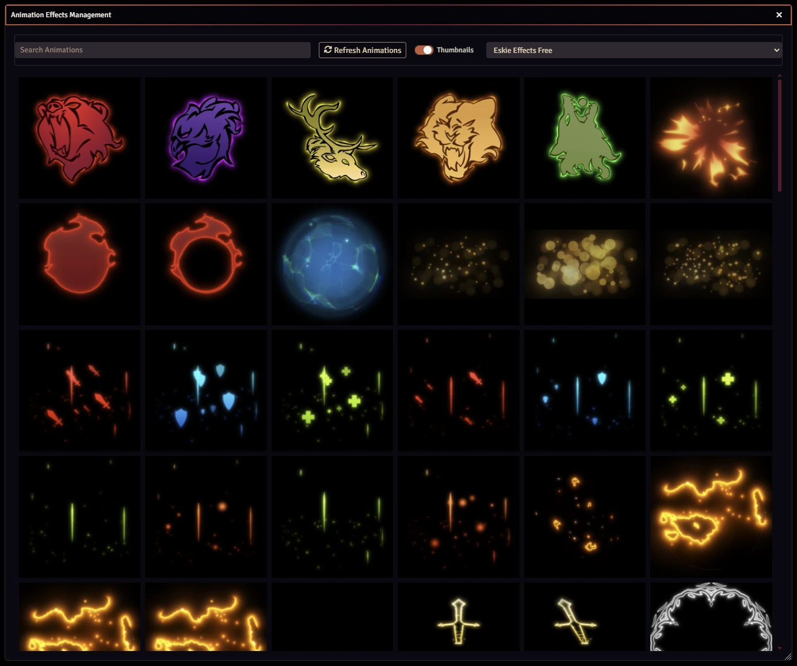
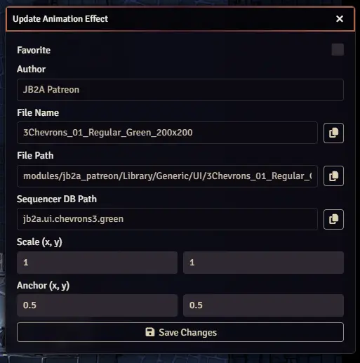
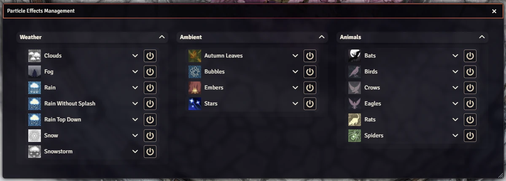
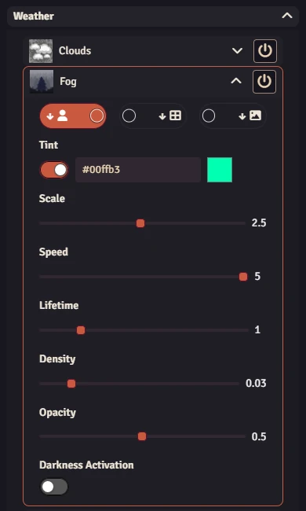
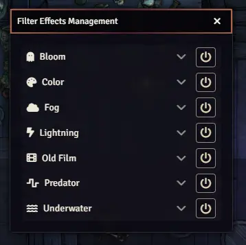
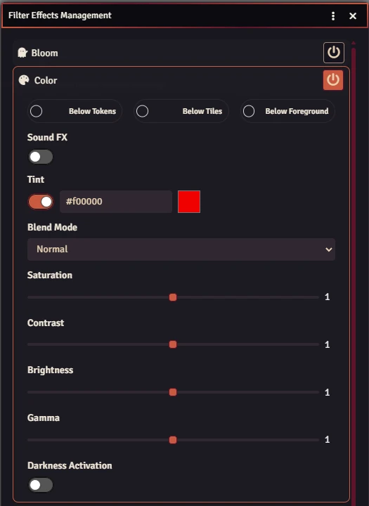

<h1 style="text-align: center;">Gambit's FXMaster</h1>
<p style="text-align: center;">  <a href="https://discord.gg/YvxHrJ4tVu" target="_blank" rel="nofollow noopener"></a></p>
<h2 style="text-align: center;">Supporting The Module</h2>
<p style="text-align: center;"><a href="https://ko-fi.com/gambit07" target="_blank" rel="nofollow noopener"></a> <a href="https://www.patreon.com/GambitsLounge" target="_blank" rel="nofollow noopener">  </a></p>
<hr/>
<p>Welcome to the official release of the application V2 overhaul for FXMaster! A lot of time and effort went into this conversion and new functionality has been added, including Region particle masking, as well as the addition of Region specific Particle Effects. The Special Effects control has been re-named to Animation Effects, and functionality has been broadly changed. FXMaster no longer supports features that overlapped with Sequencer. The FXMaster implementation was extremely dated, and Sequencer has superior functionality. Instead, the Animation Effects app has been converted to a more functional menu for searching, previewing, and favoriting animations from all major animation modules, while still allowing static tile placement via drag and drop.</p>

**<p>Any support via the <a href="https://www.patreon.com/GambitsLounge" target="_blank" rel="nofollow noopener">Patreon</a> or <a href="https://ko-fi.com/gambit07" target="_blank" rel="nofollow noopener">Ko-fi</a> is greatly appreciated! If you are a Patreon subscriber you will receive access to the FXMaster+ module. FXMaster+ can be downloaded from Patreon, and it's where I will be adding new particle effects and filters moving forward. For the intial release, it will get you access to the <span style="color:yellow">Fireflies</span>, <span style="color:pink">Sakura Bloom</span>, and <span style="color:pink">Sakura Blossoms</span> Particle Effects previewed below:</p>**

<video autoplay muted playsinline loop preload="auto" src="https://github.com/user-attachments/assets/543298b6-0d53-4cff-995d-6b4ca1fbc2b2"></video>
<video autoplay muted playsinline loop preload="auto" src="https://github.com/user-attachments/assets/dfc880e7-f148-4db1-b509-2ef2332ede7a"></video>

<hr/>

FXMaster is a module for [Foundry Virtual Tabletop] that provides various types of effects:

- _Particle Effects_, including weather (rain, clouds, fog, snow, etc.), animals (crows, bats, spiders, etc.), and a few
  others.
- _Filter Effects_, including color overlays, underwater, and lightning.
- _Animation Effects_, using video files provided by external sources.

This module also provides ways to easily configure these effects.

## Table of Contents

- [FXMaster](#fxmaster)
  - [Table of Contents](#table-of-contents)
  - [Installation Instructions](#installation-instructions)
  - [FAQ](#faq)
  - [Usage](#usage)
    - [Animation Effects&nbsp;&nbsp;<picture style="display:inline-block; vertical-align:bottom;"><source srcset="./media/font-awesome/hat-wizard-light.svg" media="(prefers-color-scheme: dark)"> <source srcset="./media/font-awesome/hat-wizard-dark.svg" media="(prefers-color-scheme: light)"> </picture>](#animation-effects)
      - [Placing Animation Effects](#placing-animation-effects)
      - [Managing Animation Effects](#managing-animation-effects)
    - [Particle Effects&nbsp;&nbsp;<picture style="display:inline-block; vertical-align:bottom;"><source srcset="./media/font-awesome/cloud-rain-light.svg" media="(prefers-color-scheme: dark)"><source srcset="./media/font-awesome/cloud-rain-dark.svg" media="(prefers-color-scheme: light)"></picture>](#particle-effects)
      - [Masking Particle Effects](#masking-particle-effects)
      - [⚠ Warning Regarding Large Scenes](#-warning-regarding-large-scenes)
    - [Invert Particle Effect Mask&nbsp;&nbsp;<picture style="display:inline-block; vertical-align:bottom;"><source srcset="./media/font-awesome/mask-light.svg" media="(prefers-color-scheme: dark)"> <source srcset="./media/font-awesome/mask-dark.svg" media="(prefers-color-scheme: light)"> </picture>](#invert-particle-effect-mask)
    - [Filter Effects&nbsp;&nbsp;<picture style="display:inline-block; vertical-align:bottom;"><source srcset="./media/font-awesome/filter-light.svg" media="(prefers-color-scheme: dark)"> <source srcset="./media/font-awesome/filter-dark.svg" media="(prefers-color-scheme: light)"> </picture>](#filter-effects)
    - [Save Particle and Filter Effects as a Macro&nbsp;&nbsp;<picture style="display:inline-block; vertical-align:bottom;"><source srcset="./media/font-awesome/floppy-disk-light.svg" media="(prefers-color-scheme: dark)"> <source srcset="./media/font-awesome/floppy-disk-dark.svg" media="(prefers-color-scheme: light)"> </picture>](#save-particle-and-filter-effects-as-macro)
    - [Clear Particle and Filter Effects&nbsp;&nbsp;<picture style="display:inline-block; vertical-align:bottom;"><source srcset="./media/font-awesome/trash-light.svg" media="(prefers-color-scheme: dark)"> <source srcset="./media/font-awesome/trash-dark.svg" media="(prefers-color-scheme: light)"> </picture>](#clear-particle-and-filter-effects)
  - [Developer API](#developer-api)
    - [Filter Effects](#filter-effects)
      - [Available Filter Effects With Supported Options](#available-filter-effects-with-supported-options)
    - [Particle Effects](#particle-effects)
      - [Available Particle Effects With Supported Options](#available-particle-effects-with-supported-options)
      - [Particle Effect Options](#particle-effect-options)
  - [Contributing](#contributing)
  - [Acknowledgement](#acknowledgement)
  - [Licensing](#licensing)

## Installation Instructions

To install FXMaster, find FXMaster in the module browser, or paste the following URL into the Install Module dialog in
the Setup menu of Foundry Virtual Tabletop:

```
https://github.com/gambit07/fxmaster/releases/latest/download/module.json
```

## FAQ

- Q: I have put a animation effect onto a scene, and now I can't get rid of it. How do I remove it?

  A: Most likely, you created a permanently playing animation effect by dragging an animation effect onto the canvas, which
  is just a regular [Tile](https://foundryvtt.com/article/tiles/) and not managed by FXMaster. To remove it, go to the
  Tile Controls and remove the Tile there.

- Q: What is the difference between Particle Effects, Filter Effects, and Animation Effects?

  A: Particle Effects are global effects that display particles on the whole scene. Mostly they are weather effects, but
  they also include animals and some other effects.<br>
  Filter Effects are filters that adjust the whole scene in some way, e.g. by adjusting the color or distorting the
  scene to look like it's underwater.<br>
  Animation Effects are animations (video files) that can be played on your chosen location on the canvas.

- Q: Can I provide my own effects?

  A: You can provide your own Animation Effects via the Custom folder in the module's settings.
  It's not possible to provide your own Particle Effects or Filter Effects.

## Usage

The functionality of FXMaster can be accessed via _Effect Controls_ <picture style="display:inline-block; vertical-align:bottom;"><source srcset="./media/font-awesome/wand-magic-sparkles-light.svg" media="(prefers-color-scheme: dark)"> <source srcset="./media/font-awesome/wand-magic-sparkles-dark.svg" media="(prefers-color-scheme: light)"> </picture> in scene controls. Each FXMaster app has its own tool inside scene controls.

### Animation Effects&nbsp;&nbsp;<picture style="display:inline-block; vertical-align:bottom;"><source srcset="./media/font-awesome/hat-wizard-light.svg" media="(prefers-color-scheme: dark)"> <source srcset="./media/font-awesome/hat-wizard-dark.svg" media="(prefers-color-scheme: light)"> </picture>

_Animation Effects_ are video files that can be previewed and/or placed on the canvas via clicking and dragging. FXMaster aggregates animations from popular animation module providers including: [JB2A], [Jinker's Animated Art], [Jack Kerouac's Animated Spell Effects], [Jack Kerouac's Animated Spell Effects Cartoon], [Boss Loot Animated Assets], and [Wild Magic Surge]. Along side the built in module support, you can also add your own Custom folder of animations from the modules settings.

On first world load after updating or installing FXMaster, the animation effects database will be built. You will see an active UI notification window while this process runs. It can take anywhere from 5 to 10 minutes depending on how many animations exist in your world. Once the process completes, you are ready to use the Animation Effects window. If you ever add or remove animations, either from a Custom folder or an Animation module, you can re-build the animations database at any time via the Settings menu option "Refresh Animations Database."

Clicking on this tool opens the _Animation Effects Management_ app:



In this app, you can filter based on specific animation providers and search for specific animations. Searching supports advanced queries using AND, OR, and NOT, e.g.: (eldritch OR arrow) AND NOT blast

You can preview each effect by hovering over the black box with your mouse.

#### Placing Animation Effects

In order to place an _Animation Effect_, simply drag it from the window to the canvas which will create a [Tile](https://foundryvtt.com/article/tiles/) on the canvas that includes your animation.

#### Managing Animation Effects

_Animation Effects_ details can be viewed by right clicking an animation icon in the window. Details included are the Author, File Name, File Path, and Sequencer Path. Additionally, you can adjust the Scale and Anchor of a placed tile within this menu. Finally, you can Favorite an animation within this window, which will create a Favorites tag in the main window dropdown. If you make a change, hit the "Save Changes" button to save the _Animation Effect_ and close the app.



### Particle Effects&nbsp;&nbsp;<picture style="display:inline-block; vertical-align:bottom;"><source srcset="./media/font-awesome/cloud-rain-light.svg" media="(prefers-color-scheme: dark)"><source srcset="./media/font-awesome/cloud-rain-dark.svg" media="(prefers-color-scheme: light)"></picture>

_Particle Effects_ include weather effects like rain, fog, clouds, and snow, but also other global particle effects such as birds flying across the scene or spiders crawling around. 

There are two ways to implement _Particle Effects_: via the _Effect Controls_ menu for global _Particle Effects_, or via a [Region](https://foundryvtt.com/article/scene-regions/) using the _FXMaster: Particle Effects_ Region behavior.

### Particle Effects via Effect Controls App&nbsp;&nbsp;<picture style="display:inline-block; vertical-align:bottom;"><source srcset="./media/font-awesome/cloud-rain-light.svg" media="(prefers-color-scheme: dark)"><source srcset="./media/font-awesome/cloud-rain-dark.svg" media="(prefers-color-scheme: light)"></picture>

Clicking on the _Effect Controls_ tool opens the _Particle Effects Management_ app:



In this app, you can configure individual _Particle Effects_. They are sorted into different groups ("Weather", "Ambient", and "Animals").

You can activate individual _Particle Effects_ by clicking the corresponding toggle button.

By clicking on the name of a _Particle Effect_, you expand it, showing the options for that effect:



### Particle Effects via Region Behavior

After adding a Region, open the Region config menu and navigate to the Behaviors tab. Add a new behavior and select the option 'FXMaster: Particle Effects': 


In this menu, you can configure individual _Particle Effects_ in the same way as in the main app. Selecting the checkbox next to a _Particle Effect_ will display a dropdown of its options. Saving the Region behavior will add the selected _Particle Effects_ to the region.

In addition, you can subscribe the Region behavior to specific events. In V12, these events are "Token Enter" and "Token Exit." In V13, these events are "Token Animates In" and "Token Animates Out." These events will cause the particle effect to not display immediately, only occur when a token enters, and be removed when a token exits. Keep in mind, these events will display the _Particle Effects_ to all tokens when a token enters. In Foundry V14, there may be additional height functionality to only display the particles for a specific elevation level.

The available options differ slightly between _Particle Effects_ because not all options make sense across effects. The options are:

| Option     | Description                                                                                                                 |
| ---------- | --------------------------------------------------------------------------------------------------------------------------- |
| Scale      | A factor that scales the effect relative to its base size.                                                                  |
| Direction  | The direction of the effect in degrees.                                                                                     |
| Speed      | A factor that adjusts the speed of the effect relative to its base speed.                                                   |
| Lifetime   | A factor that adjusts the lifetime of the individual particles.                                                             |
| Density    | The density of the effect. For most effects, it represents the number of particles per grid unit.                           |
| Opacity    | A factor between 0 and 1 that adjusts the opacity of the particles.                                                         |
| Tint       | Tint the effect with this color.                                                                                            |
| Animations | A selection of animations from the list of animations for the effect to use. If it is empty, the default animation is used. |

When a toggle for a particle effect is turned on, adjustments to that _Particle Effect_'s options will be implemented in real time.

#### Masking Particle Effects

By default, _Particle Effects_ added via the app are displayed across the entire scene. However, it is possible to constrain them to
specific areas. This can be achieved within Drawings by marking them as _Particle Effect Mask_. To do that,
open the HUD for the drawing (by right-clicking the drawing) and then click on the "Mask FXMaster Particle Effects"
control icon <picture style="display:inline-block; vertical-align:bottom;"><source srcset="./media/font-awesome/cloud-light.svg" media="(prefers-color-scheme: dark)"><source srcset="./media/font-awesome/cloud-dark.svg" media="(prefers-color-scheme: light)"></picture>

Additionally, Regions can be masked by using the Region behavior "Suppress Weather."

By default, _Particle Effects_ are only displayed outside the marked areas when masked. This can be inverted via the
[_Invert Particle Effect Mask_](#invert-particle-effect-mask-) tool.

#### ⚠ Warning Regarding Large Scenes

*Legacy Note - I do not think this is as much of a concern on V12 or V13 foundry, but leaving it here for posterity's sake*: The _Particle Effects_ provided by FXMaster can have a pretty significant
impact on performance in large scenes (around 10,000 px × 10,000 px and larger). Be careful when enabling
_Particle Effects_ in such scenes as it might make them crash. If that happens, launch the world in safe configuration
and delete the configured _Particle Effects_ for the scene by running the following as a script macro or in the
developer console (F12):

```js
canvas.scene.unsetFlag("fxmaster", "effects");
```

You can then safely reactivate your modules.

### Invert Particle Effect Mask&nbsp;&nbsp;<picture style="display:inline-block; vertical-align:bottom;"><source srcset="./media/font-awesome/mask-light.svg" media="(prefers-color-scheme: dark)"> <source srcset="./media/font-awesome/mask-dark.svg" media="(prefers-color-scheme: light)"> </picture>

Clicking on this tool inverts the _Particle Effect Mask_ for the current scene. This tool acts as a toggle and the color
indicates whether it is currently active or not.

Inverting the _Particle Effect Mask_ can be very useful when the goal is to display _Particle Effects_ only in specific
smaller areas, instead of specifying the areas in which they should not be displayed, which is the default.

### Filter Effects&nbsp;&nbsp;<picture style="display:inline-block; vertical-align:bottom;"><source srcset="./media/font-awesome/filter-light.svg" media="(prefers-color-scheme: dark)"> <source srcset="./media/font-awesome/filter-dark.svg" media="(prefers-color-scheme: light)"> </picture>

_Filter Effects_ work similarly to _Particle Effects_. They are also displayed all across the entire scene, but unlike
_Particle Effects_ it's _not_ possible to confine them to certain areas with a mask.

Clicking on this tool opens the _Filter Effects Management_ app:



You can activate individual _Filter Effects_ by clicking the corresponding toggle button.

By clicking on the name of a _Filter Effect_, you expand it, showing the options for that effect:



The available options differ heavily between individual _Filter Effects_, so it doesn't make much sense to list them
here.

The options will be adjusted in real-time as you make changes to them.

### Save Particle and Filter Effects as a Macro&nbsp;&nbsp;<picture style="display:inline-block; vertical-align:bottom;"><source srcset="./media/font-awesome/floppy-disk-light.svg" media="(prefers-color-scheme: dark)"> <source srcset="./media/font-awesome/floppy-disk-dark.svg" media="(prefers-color-scheme: light)"> </picture>

This tool allows you to create a macro from the currently active _Particle Effects_ and _Filter Effects_. When clicking
this tool, a macro is created in the macro directory. It's not put onto the hotbar, so you need to drag it there
yourself if you want to.

When executed, the macro sets the _Particle Effects_ and _Filter Effects_ of the current scene to the state they were in
when the macro was created.

### Clear Particle and Filter Effects&nbsp;&nbsp;<picture style="display:inline-block; vertical-align:bottom;"><source srcset="./media/font-awesome/trash-light.svg" media="(prefers-color-scheme: dark)"> <source srcset="./media/font-awesome/trash-dark.svg" media="(prefers-color-scheme: light)"> </picture>

When clicked, this tool shows a confirmation dialog to delete all _Particle Effects_ and _Filter Effects_ from the
current scene.

## Developer API

FXMaster provides functionality to interact with _Filter Effects_ and _Particle Effects_ from other packages and macros.

### Filter Effects

- Adding or updating a named filter
  ```javascript
  FXMASTER.filters.addFilter("myfilterID", "color", {
    color: { value: "#ff00ff", apply: true },
    gamma: 1.0,
    contrast: 1.0,
    brightness: 1.0,
    saturation: 0.2,
  });
  ```
- Removing a named filter
  ```javascript
  FXMASTER.filters.removeFilter("myfilterID");
  ```
- Toggling a named filter on and off
  ```javascript
  FXMASTER.filters.switch("myfilterID", "color", {
    color: { value: "#ff00ff", apply: true },
    gamma: 1.0,
    contrast: 1.0,
    brightness: 1.0,
    saturation: 0.2,
  });
  ```
- Setting the list of active filters
  ```javascript
  FXMASTER.filters.setFilters([
    {
      type: "color",
      options: {
        /* ... */
      },
    },
    {
      type: "lightning",
      options: {
        /* ... */
      },
    },
  ]);
  ```

#### Available Filter Effects With Supported Options

| Type         | Options                                                  |
| ------------ | -------------------------------------------------------- |
| `lightning`  | `frequency`, `spark_duration`, `brightness`              |
| `underwater` | `speed`, `scale`                                         |
| `predator`   | `noise`, `period`, `lineWidth`                           |
| `color`      | `color`, `saturation`, `contrast`, `brightness`, `gamma` |
| `bloom`      | `blur`, `bloomScale`, `threshold`                        |
| `oldfilm`    | `sepia`, `noise`                                         |

You can get a complete list by typing `CONFIG.fxmaster.filters` in your web console.

### Particle Effects

- Switching a named particle effect on and off:
  ```javascript
  Hooks.call("fxmaster.switchParticleEffect", {
    name: "myParticleEffectID",
    type: "rain",
    options: { density: 0.5 },
  });
  ```
- Setting the active paticle effects:
  ```javascript
  Hooks.call("fxmaster.updateParticleEffects", [
    {
      type: "rain",
      options: {
        /* ... */
      },
    },
    {
      type: "bubbles",
      options: {
        /* ... */
      },
    },
  ]);
  ```

#### Available Particle Effects With Supported Options

| Type           | `scale` | `direction` | `speed` | `lifetime` | `density` | `alpha` | `tint` |         `animations`         |
| -------------- | :-----: | :---------: | :-----: | :--------: | :-------: | :-----: | :----: | :--------------------------: |
| `snowstorm`    |    ✓    |      ✓      |    ✓    |     ✓      |     ✓     |    ✓    |   ✓    |                              |
| `bubbles`      |    ✓    |             |    ✓    |     ✓      |     ✓     |    ✓    |   ✓    |                              |
| `clouds`       |    ✓    |      ✓      |    ✓    |     ✓      |           |    ✓    |   ✓    |                              |
| `embers`       |    ✓    |             |    ✓    |     ✓      |     ✓     |    ✓    |   ✓    |                              |
| `rainsimple`   |    ✓    |      ✓      |    ✓    |     ✓      |     ✓     |    ✓    |   ✓    |                              |
| `stars`        |    ✓    |             |    ✓    |     ✓      |     ✓     |    ✓    |   ✓    |                              |
| `crows`        |    ✓    |             |    ✓    |     ✓      |     ✓     |    ✓    |   ✓    |                              |
| `bats`         |    ✓    |             |    ✓    |     ✓      |     ✓     |    ✓    |   ✓    |                              |
| `spiders`      |    ✓    |             |    ✓    |     ✓      |     ✓     |    ✓    |   ✓    |                              |
| `fog`          |    ✓    |             |    ✓    |     ✓      |     ✓     |    ✓    |   ✓    |                              |
| `raintop`      |    ✓    |      ✓      |    ✓    |     ✓      |     ✓     |    ✓    |   ✓    |                              |
| `birds`        |    ✓    |             |    ✓    |     ✓      |     ✓     |    ✓    |   ✓    | ✓ (`glide`, `flap`, `mixed`) |
| `leaves`       |    ✓    |             |    ✓    |     ✓      |     ✓     |    ✓    |   ✓    |                              |
| `rain`         |    ✓    |      ✓      |    ✓    |     ✓      |     ✓     |    ✓    |   ✓    |                              |
| `snow`         |    ✓    |      ✓      |    ✓    |     ✓      |     ✓     |    ✓    |   ✓    |                              |
| `eagles`       |    ✓    |             |    ✓    |     ✓      |     ✓     |    ✓    |   ✓    |     ✓ (`glide`, `flap`)      |
| `rats`         |    ✓    |             |    ✓    |     ✓      |     ✓     |    ✓    |   ✓    |                              |
| `sakurabloom`  |    ✓    |      ✓      |    ✓    |     ✓      |     ✓     |    ✓    |   ✓    |                              |
| `sakurablossom`|    ✓    |             |    ✓    |     ✓      |     ✓     |    ✓    |   ✓    |                              |

#### Particle Effect Options

| Option       | Type                              | Description                                                                                                                         |
| ------------ | --------------------------------- | ----------------------------------------------------------------------------------------------------------------------------------- |
| `scale`      | `number`                          | A factor that scales the effect relative to its base size.                                                                          |
| `direction`  | `number`                          | The direction of the effect in degrees.                                                                                             |
| `speed`      | `number`                          | A factor that adjusts the speed of the effect relative to its base speed.                                                           |
| `lieftime`   | `number`                          | A factor that adjusts the lifetime of the individual particles.                                                                     |
| `density`    | `number`                          | The density of the effect. For most effects, it represents the number of particles per grid unit.                                   |
| `alpha`      | `number`                          | A factor between 0 and 1 that adjusts the opacity of the particles (this is called "Opacity" in Particle Effects Management).       |
| `tint`       | `{value: string, apply: boolean}` | Tint the effect with this color.                                                                                                    |
| `animations` | `string[]`                        | An array of animations from list of animations for the effect to use. If it is empty or not defined, the default animation is used. |

## Contributing

Code and content contributions are accepted. Please feel free to submit issues to the issue tracker or submit pull
requests for code changes.

## Acknowledgement

Many thanks to:

- [U~man] for the original work on this module.
- [ghost] for maintaining functionality on this module for the past few years.
- [theripper93] for contributing his ideas regarding handling particle effect masking elegantly.
- [Wasp] for providing the [Sequencer] module that will inspire future updates.
- [SecretFire] for exchanging ideas, providing help, and shaders for the filter effects. Donate
  [here](https://ko-fi.com/secretfire).

## Licensing

- The software component of FXMaster is licensed under [BSD 3-Clause].
- The Seagull sprites used in the Birds particle effect are from [whtdragon].
- The control and tool icons are from [Font Awesome], licensed under the [CC BY-4.0].
- The icons for particle effects are by Rexard and licensed under [Rexard Game Dev Assets EULA].
- The rat sprites used in the Rats particle effect by crymoonster are licensed under [CC BY-4.0].

[Foundry Virtual Tabletop]: https://foundryvtt.com/
[JB2A]: https://github.com/Jules-Bens-Aa/JB2A_DnD5e
[Jinker's Animated Art]: https://github.com/jinkergm/JAA
[Jack Kerouac's Animated Spell Effects]: https://github.com/jackkerouac/animated-spell-effects
[Jack Kerouac's Animated Spell Effects Cartoon]: https://github.com/jackkerouac/animated-spell-effects-cartoon
[Boss Loot Animated Assets]: https://github.com/boss-loot/boss-loot-assets-free
[Wild Magic Surge]: https://foundryvtt.com/packages/wild_magic_surge_animated_dungeon_lighting_one
[Sequencer]: https://github.com/fantasycalendar/FoundryVTT-Sequencer
[U~man]: https://github.com/mesfoliesludiques
[ghost]: https://github.com/ghost-fvtt
[theripper93]: https://github.com/theripper93
[Wasp]: https://github.com/fantasycalendar
[SecretFire]: https://github.com/Feu-Secret
[whtdragon]: https://forums.rpgmakerweb.com/index.php?threads/whtdragons-animals-and-running-horses-now-with-more-dragons.53552/
[Font Awesome]: https://fontawesome.com/
[BSD 3-Clause]: ./LICENSES/BSD-3-Clause.txt
[CC BY-NC-SA-4.0]: ./LICENSES/CC-BY-NC-SA-4.0.txt
[CC BY-4.0]: ./LICENSES/CC-BY-4.0.txt
[Rexard Game Dev Assets EULA]: ./LICENSES/LicenseRef-RexardGameDevAssetsEULA.txt
