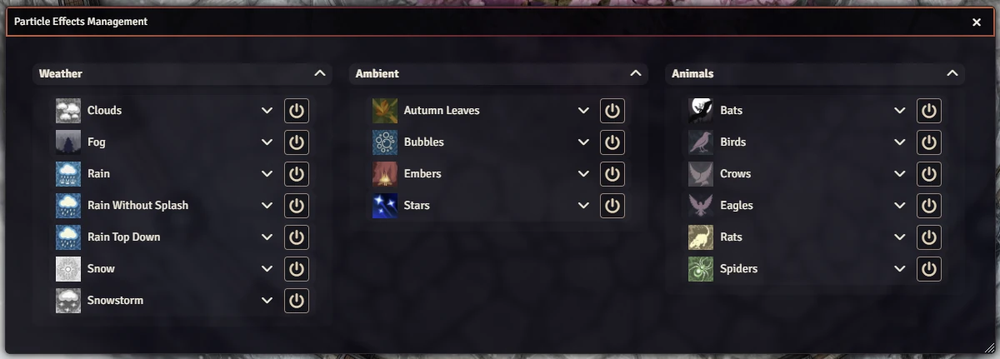
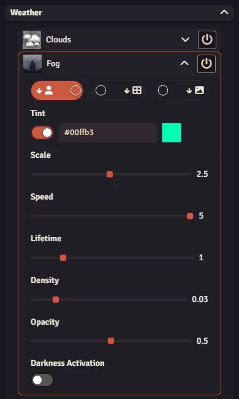
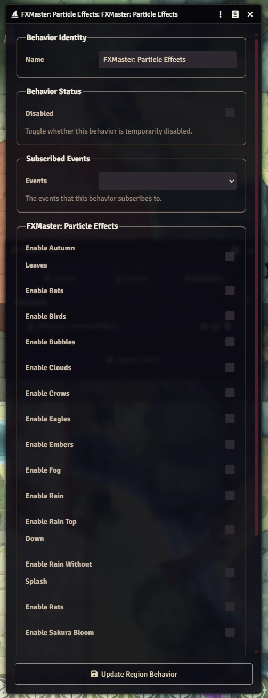
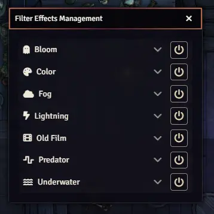
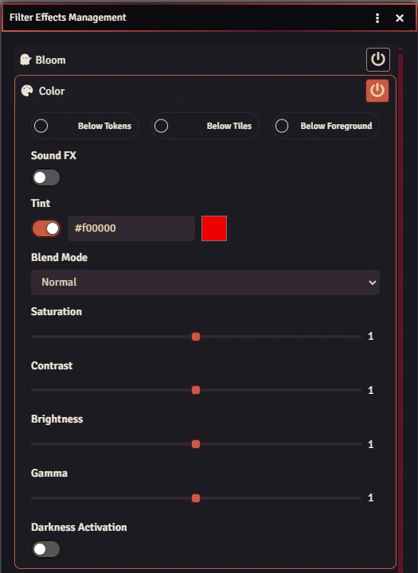
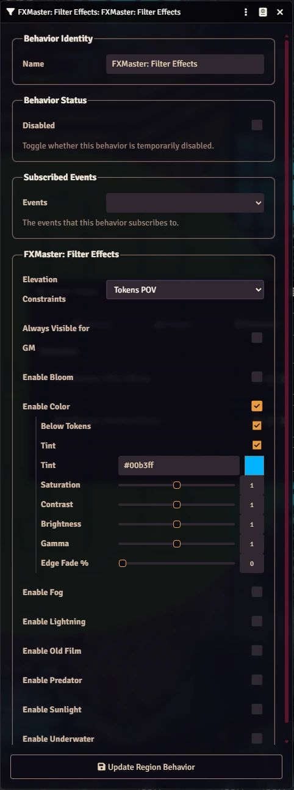

<h1 style="text-align: center;">Gambit's FXMaster</h1>
<p style="text-align: center;">  <a href="https://discord.gg/YvxHrJ4tVu" target="_blank" rel="nofollow noopener"></a></p>
<video
  autoplay
  muted
  playsinline
  loop
  preload="auto"
  src="https://github.com/user-attachments/assets/fddaf4b7-767e-4a48-be22-8df87188f257">
</video>
<h2 style="text-align: center;">Supporting The Module</h2>
<p style="text-align: center;"><a href="https://ko-fi.com/gambit07" target="_blank" rel="nofollow noopener"></a> <a href="https://www.patreon.com/GambitsLounge" target="_blank" rel="nofollow noopener">  </a></p>
<hr/>
<p>Welcome to the official release of FXMaster V7.5! This release brings some new functionality for Particle regions, as well as Particle and Filter Suppression regions. All of these behavior types now have an optional Edge Fade % parameter that should allow for more naturalistic looking region areas. Hope everyone enjoys!</p>

**<p>Any support via the <a href="https://www.patreon.com/GambitsLounge" target="_blank" rel="nofollow noopener">Patreon</a> or <a href="https://ko-fi.com/gambit07" target="_blank" rel="nofollow noopener">Ko-fi</a> is greatly appreciated! If you are a Patreon subscriber you will receive access to the FXMaster+ module. FXMaster+ can be accessed from Patreon, and it's where I will be adding new particle effects and filters moving forward. For the month of April, it will get you access to the ⚪Wind, ⚪Wind Wisp, 🔵Water, 🟡Lightning Bolts, 🔵Fish, 🟢Glitch, 🔵Ice, 🟤Duststorm, 🟤Sandstorm, 🟢Ghosts, 🟡Sunlight, 🟢Magic Crystals, 🟡Fireflies, 🌸Sakura Bloom, and 🌸Sakura Blossoms Effects - Effects are previewed below:</p>**

<video
  autoplay
  muted
  playsinline
  loop
  preload="auto"
  src="https://github.com/user-attachments/assets/cbeb1216-8ee0-49b1-b6df-9d69a74b9731">
</video>

<details>
  <summary>Lightning Bolts (click to expand)</summary>
  <video
    autoplay
    muted
    playsinline
    loop
    preload="auto"
    src="https://github.com/user-attachments/assets/c85cc30c-18a2-4de4-8057-87c70a7dcbf4">
  </video>
</details>

<details>
  <summary>Fish (click to expand)</summary>
  <video
    autoplay
    muted
    playsinline
    loop
    preload="auto"
    src="https://github.com/user-attachments/assets/8e55950b-d19b-4222-a769-7782a7fa1e3e">
  </video>
</details>

<details>
  <summary>Glitch (click to expand)</summary>
  <video
    autoplay
    muted
    playsinline
    loop
    preload="auto"
    src="https://github.com/user-attachments/assets/5a31c44b-018e-46e0-b903-b34b6ac73448">
  </video>
</details>

<details>
  <summary>Ice (click to expand)</summary>
  <video
    autoplay
    muted
    playsinline
    loop
    preload="auto"
    src="https://github.com/user-attachments/assets/e4a6a6e6-723f-4d03-9e1c-591c5b2c03c6">
  </video>
</details>

<details>
  <summary>Duststorm + Sandstorm (click to expand)</summary>
  <video
    autoplay
    muted
    playsinline
    loop
    preload="auto"
    src="https://github.com/user-attachments/assets/f5b05f09-f59a-4ac3-b9e1-54a35772ade7">
  </video>
</details>

<details>
  <summary>Ghosts (click to expand)</summary>
  <video
    autoplay
    muted
    playsinline
    loop
    preload="auto"
    src="https://github.com/user-attachments/assets/7cb29ad3-7b63-4186-acdd-cd23575d870b">
  </video>
</details>

<details>
  <summary>Sunlight (click to expand)</summary>
  <video
    autoplay
    muted
    playsinline
    loop
    preload="auto"
    src="https://github.com/user-attachments/assets/4bb9492d-dc3b-4d2e-82ee-6950cd2792eb">
  </video>
</details>
  
<details>
  <summary>Magic Crystals (click to expand)</summary>

  <video
    autoplay
    muted
    playsinline
    loop
    preload="auto"
    src="https://github.com/user-attachments/assets/7e35693a-094b-43d0-9249-584216b1df16">
  </video>
</details>

<details>
  <summary>Fireflies (click to expand)</summary>

  <video
    autoplay
    muted
    playsinline
    loop
    preload="auto"
    src="https://github.com/user-attachments/assets/860557a5-602e-4e80-a241-af06db3b2c1f">
  </video>
</details>

<details>
  <summary>Sakura Bloom (click to expand)</summary>

  <video
    autoplay
    muted
    playsinline
    loop
    preload="auto"
    src="https://github.com/user-attachments/assets/dfc880e7-f148-4db1-b509-2ef2332ede7a">
  </video>
</details>

<hr/>

FXMaster is a module for [Foundry Virtual Tabletop] that provides various types of effects:

- _Particle Effects_, including weather (rain, clouds, fog, snow, etc.), animals (crows, bats, spiders, etc.), and a few
  others.
- _Filter Effects_, including color overlays, underwater, lightning, and more.

This module also provides ways to easily configure these effects.

## Table of Contents

- [FXMaster](#fxmaster)
  - [Table of Contents](#table-of-contents)
  - [Installation Instructions](#installation-instructions)
  - [FAQ](#faq)
  - [Usage](#usage)
    - [Particle Effects](#particle-effects)&nbsp;&nbsp;<picture style="display:inline-block; vertical-align:bottom;"><source srcset="./media/font-awesome/cloud-rain-light.svg" media="(prefers-color-scheme: dark)"><source srcset="./media/font-awesome/cloud-rain-dark.svg" media="(prefers-color-scheme: light)"></picture>
      - [Particle Effects via Region Behavior](#particle-effects-via-region-behavior)
      - [Masking Particle Effects](#masking-particle-effects)
      - [⚠ Performance Note](#-performance-note)
    - [Filter Effects](#filter-effects)&nbsp;&nbsp;<picture style="display:inline-block; vertical-align:bottom;"><source srcset="./media/font-awesome/filter-light.svg" media="(prefers-color-scheme: dark)"> <source srcset="./media/font-awesome/filter-dark.svg" media="(prefers-color-scheme: light)"> </picture>
      - [Filter Effects via Region Behavior](#filter-effects-via-region-behavior)
      - [Masking Filter Effects](#masking-filter-effects)
    - [API Effects UI Manager](#api-effects-ui-manager)
    - [Save Particle and Filter Effects as a Macro](#save-particle-and-filter-effects-as-a-macro)&nbsp;&nbsp;<picture style="display:inline-block; vertical-align:bottom;"><source srcset="./media/font-awesome/floppy-disk-light.svg" media="(prefers-color-scheme: dark)"> <source srcset="./media/font-awesome/floppy-disk-dark.svg" media="(prefers-color-scheme: light)"> </picture>
    - [Clear Particle and Filter Effects](#clear-particle-and-filter-effects)&nbsp;&nbsp;<picture style="display:inline-block; vertical-align:bottom;"><source srcset="./media/font-awesome/trash-light.svg" media="(prefers-color-scheme: dark)"> <source srcset="./media/font-awesome/trash-dark.svg" media="(prefers-color-scheme: light)"> </picture>
  - [Levels](#levels)
    - [Using Levels with Scene Effects](#using-levels-with-scene-effects)
  - [Layers](#layers)
    - [Manage Layers Window](#manage-layers-window)
  - [Developer API](#developer-api)
    - [Presets API](#presets-api)
    - [Effects API](#effects-api)
      - [Effect Entry Shape](#effect-entry-shape)
      - [Effects API Arguments](#effects-api-arguments)
      - [Play, Stop, and Toggle](#play-stop-and-toggle)
      - [Scoped Helpers](#scoped-helpers)
      - [Built-in Filter Effect Types](#built-in-filter-effect-types)
      - [Built-in Particle Effect Types](#built-in-particle-effect-types)
      - [Common Particle Effect Options](#common-particle-effect-options)
  - [Contributing](#contributing)
  - [Acknowledgement](#acknowledgement)
  - [Licensing](#licensing)

## Installation Instructions

To install FXMaster, find FXMaster in the module browser, or paste the following URL into the Install Module dialog in
the Setup menu of Foundry Virtual Tabletop:

```
https://github.com/gambit07/fxmaster/releases/latest/download/module.json
```

## FAQ

- Q: What is the difference between Particle Effects and Filter Effects?

  A: Particle Effects are global effects that display particles on the whole scene. Mostly they are weather effects, but
  they also include animals and some other effects.<br>
  Filter Effects are filters that adjust the whole scene in some way, e.g. by adjusting the color or distorting the
  scene to look like it's underwater.

- Q: Can I provide my own effects?

  A: You can provide your own Particle Effects when using FXMaster+ in the Manage User Particle Effects menu.
  It's not possible to provide your own Filter Effects.

## Usage

The functionality of FXMaster can be accessed via _FXMaster Controls_ <picture style="display:inline-block; vertical-align:bottom;"><source srcset="./media/font-awesome/wand-magic-sparkles-light.svg" media="(prefers-color-scheme: dark)"> <source srcset="./media/font-awesome/wand-magic-sparkles-dark.svg" media="(prefers-color-scheme: light)"> </picture> in scene controls. Each FXMaster app has its own tool inside scene controls.

### Particle Effects&nbsp;&nbsp;<picture style="display:inline-block; vertical-align:bottom;"><source srcset="./media/font-awesome/cloud-rain-light.svg" media="(prefers-color-scheme: dark)"><source srcset="./media/font-awesome/cloud-rain-dark.svg" media="(prefers-color-scheme: light)"></picture>

_Particle Effects_ include weather effects like rain, fog, clouds, and snow, but also other global particle effects such as birds flying across the scene or spiders crawling around. 

There are two ways to implement _Particle Effects_: via the _FXMaster Controls_ menu for global _Particle Effects_, or via a [Region](https://foundryvtt.com/article/scene-regions/) using the _FXMaster: Particle Effects_ Region behavior.

#### Particle Effects via FXMaster Controls App

Clicking on the _FXMaster Controls_ tool opens the _Particle Effects Management_ app:



In this app, you can configure individual _Particle Effects_. They are sorted into different groups ("Weather", "Ambient", and "Animals").

You can activate individual _Particle Effects_ by clicking the corresponding toggle button.

By clicking on the name of a _Particle Effect_, you expand it, showing the options for that effect:



#### Particle Effects via Region Behavior

After adding a Region, open the Region config menu and navigate to the Behaviors tab. Add a new behavior and select the option 'FXMaster: Particle Effects': 



- In this menu, you can configure individual _Particle Effects_ in the same way as in the main app, and add region elevation visibility handling.
  - Selecting the checkbox next to a _Particle Effect_ will display a dropdown of its options.
  - Saving the Region behavior will add the selected _Particle Effects_ to the region.
  - For region elevation, use the **Elevation Constraints** dropdown.

- **Elevation Constraints**
  - **None** - No elevation restrictions are considered.
  - **Tokens POV** - Visibility will be restricted to a given token’s POV.
    - Example: If the region elevation bottom is set to 10 feet and the region elevation top is set to 20 feet, the particle effect will be visible to the token while their elevation is between 10 and 20 feet.
    - Example: If the region elevation bottom is set to 10 feet and the region elevation top is infinite, the particle effect will be visible to the token while their elevation is 10 feet or above.
    - Example: If the region elevation bottom is infinite and the region elevation top is set to 20 feet, the particle effect will be visible to the token while their elevation is 20 feet or below.
  - **Specific Tokens POV** - Same visibility as **Tokens POV**, but only allows visibility for Token UUIDs entered. Any Token UUID not entered will not be able to see the particle effect.
  - **Always Visible for GM** - Ignores **Tokens POV** for GM and makes the effect always visible.

- In addition, you can subscribe the Particle Region behavior to the **Token Enters** and **Token Exits** events.
  - These events can work in concert with the **Elevation Constraints** options, or on their own.

- **Events**
  - **Token Enters** - Effect becomes visible when a token enters the bounds of the region.
    - This event can be paired with **Token Exits** to turn an effect on and off when a token moves in/out.
    - Alternatively, you can only add **Token Enters**; in that case the effect becomes visible once a token enters and remains visible even if they exit.
  - **Token Exits** - Effect becomes not visible when a token exits the bounds of the region.


#### Masking Particle Effects

By default, _Particle Effects_ added via the app are displayed across the entire scene. However, it is possible to mask them from specific areas. This can be achieved within Regions by using the Region behavior "Suppress Weather" or "FXMaster: Suppress Scene Particles". "Suppress Weather" masks all Particle and Filter effects along with core Foundry effects, "FXMaster: Suppress Scene Particles" only masks FXMaster Particle Effects.

- When using "FXMaster: Suppress Scene Particles", there is additional region elevation visibility handling.
- **Elevation Constraints**
  - **None** - No elevation restrictions are considered.
  - **Tokens POV** - Visibility suppression will be restricted to a given token’s POV.
  - **Specific Tokens POV** - Same visibility as **Tokens POV**, but only allows visibility for Token UUIDs entered. Any Token UUID not entered will not be able to see the suppression.
  - **Always Visible for GM** - Ignores **Tokens POV** for GM and makes the suppression always visible.

- In addition, you can subscribe the Particle Region behavior to the **Token Enters** and **Token Exits** events.
  - These events can work in concert with the **Elevation Constraints** options, or on their own.

- **Events**
  - **Token Enters** - Effect becomes suppressed when a token enters the bounds of the region.
    - This event can be paired with **Token Exits** to turn suppression on and off when a token moves in/out.
    - Alternatively, you can only add **Token Enters**; in that case the effect becomes suppressed once a token enters and remains suppressed even if they exit.
  - **Token Exits** - Suppression becomes disabled when a token exits the bounds of the region.

- Finally, you can opt to enable Edge Fade %. When this setting is above 0, scene level filters will be blended into the region edges to create a more natural looking suppression area rather than a stark cutout shape

_Particle Effects_ are only displayed outside the region areas when masked. If a Hole shape is added to the region, scene particle effects will display in the hole area cutout.

#### ⚠ Performance Note

The _Particle Effects_ provided by FXMaster have recently had an overhaul for Performance in versions 7.2.0+. I've normalized particle density and added in support for Foundrys built-in Performance Mode client setting. FXMaster will now adjust density based on that setting, where percentage is the fraction of total particles set in the manager that will be emitted, Maximum = 100%, High = 75%, Medium = 50%, Low = 25% <b>(NOTE: Your players must know to use the performance mode setting within Foundry, so keep that in mind if a player has issues with performance related to effects)</b>. These changes allow much more flexibility for the GM across different player PC configurations and should prevent issues that could occur in the past on very large scenes where maximum density for a given particle effect could crash the scene. If there is an issue where too many particle effects cause a crash, launch the world in safe configuration
and delete the configured _Particle Effects_ for the scene by running the following as a script macro or in the
developer console (F12):

```js
canvas.scene.unsetFlag("fxmaster", "effects");
```

You can then safely reactivate your modules.

### Filter Effects&nbsp;&nbsp;<picture style="display:inline-block; vertical-align:bottom;"><source srcset="./media/font-awesome/filter-light.svg" media="(prefers-color-scheme: dark)"><source srcset="./media/font-awesome/filter-dark.svg" media="(prefers-color-scheme: light)"></picture>

_Filter Effects_ include effects that change the underlying scene visuals in some way like altering the color, displaying an old film effect, or adding underwater displacement.
There are two ways to implement _Filter Effects_: via the _FXMaster Controls_ menu for global _Filter Effects_, or via a [Region](https://foundryvtt.com/article/scene-regions/) using the _FXMaster: Filter Effects_ Region behavior.

#### Filter Effects via FXMaster Controls App

Clicking on this tool opens the _Filter Effects Management_ app:



You can activate individual _Filter Effects_ by clicking the corresponding toggle button.

By clicking on the name of a _Filter Effect_, you expand it, showing the options for that effect:



The available options differ heavily between individual _Filter Effects_, so it doesn't make much sense to list them
here.

The options will be adjusted in real-time as you make changes to them.

#### Filter Effects via Region Behavior

After adding a Region, open the Region config menu and navigate to the Behaviors tab. Add a new behavior and select the option 'FXMaster: Filter Effects': 



- In this menu, you can configure individual _Filter Effects_ in the same way as in the main app, and add region elevation visibility handling.
  - Selecting the checkbox next to a _Filter Effect_ will display a dropdown of its options.
  - Saving the Region behavior will add the selected _Filter Effects_ to the region.
  - For region elevation, use the **Elevation Constraints** dropdown.

- **Elevation Constraints**
  - **None** - No elevation restrictions are considered.
  - **Tokens POV** - Visibility will be restricted to a given token’s POV.
    - Example: If the region elevation bottom is set to 10 feet and the region elevation top is set to 20 feet, the filter effect will be visible to the token while their elevation is between 10 and 20 feet.
    - Example: If the region elevation bottom is set to 10 feet and the region elevation top is infinite, the filter effect will be visible to the token while their elevation is 10 feet or above.
    - Example: If the region elevation bottom is infinite and the region elevation top is set to 20 feet, the filter effect will be visible to the token while their elevation is 20 feet or below.
  - **Specific Tokens POV** - Same visibility as **Tokens POV**, but only allows visibility for Token UUIDs entered. Any Token UUID not entered will not be able to see the filter effect.
  - **Always Visible for GM** - Ignores **Tokens POV** for GM and makes the effect always visible.

- In addition, you can subscribe the Filter Region behavior to the **Token Enters** and **Token Exits** events.
  - These events can work in concert with the **Elevation Constraints** options, or on their own.

- **Events**
  - **Token Enters** - Effect becomes visible when a token enters the bounds of the region.
    - This event can be paired with **Token Exits** to turn an effect on and off when a token moves in/out.
    - Alternatively, you can only add **Token Enters**; in that case the effect becomes visible once a token enters and remains visible even if they exit.
  - **Token Exits** - Effect becomes not visible when a token exits the bounds of the region.

#### Masking Filter Effects

By default, _Filter Effects_ added via the scene app are displayed across the entire scene. However, it is possible to mask them from specific areas. This can be achieved within Regions by using the Region behavior "Suppress Weather" or "FXMaster: Suppress Scene Filters". "Suppress Weather" masks all Particle and Filter effects along with core Foundry effects, "FXMaster: Suppress Scene Filters" only masks FXMaster Filter Effects and adds additional functionality.

- When using "FXMaster: Suppress Scene Filters", there is additional region elevation visibility handling.
- **Elevation Constraints**
  - **None** - No elevation restrictions are considered.
  - **Tokens POV** - Suppression will be restricted to a given token’s POV.
  - **Specific Tokens POV** - Same visibility as **Tokens POV**, but only allows visibility for Token UUIDs entered. Any Token UUID not entered will not be able to see the suppression.
  - **Always Visible for GM** - Ignores **Tokens POV** for GM and makes the suppression always visible.

- In addition, you can subscribe the Filter Region behavior to the **Token Enters** and **Token Exits** events.
  - These events can work in concert with the **Elevation Constraints** options, or on their own.

- **Events**
  - **Token Enters** - Suppression becomes visible when a token enters the bounds of the region.
    - This event can be paired with **Token Exits** to turn suppression on and off when a token moves in/out.
    - Alternatively, you can only add **Token Enters**; in that case the suppression becomes visible once a token enters and remains visible even if they exit.
  - **Token Exits** - Suppression becomes disabled when a token exits the bounds of the region.

- Finally, you can opt to enable Edge Fade %. When this setting is above 0, scene level filters will be blended into the region edges to create a more natural looking suppression area rather than a stark cutout shape

_Filter Effects_ are only displayed outside the region areas when masked. If a Hole shape is added to the region, scene filter effects will display in the hole area cutout.

### API Effects UI Manager

The _API Effects_ manager is a utility for inspecting, editing, and removing scene-wide effects that were added via macros or presets through FXMaster’s APIs.

To open: **Scene Controls → FXMaster Controls → API Effects** (plug icon).

What it shows:

- Scene-wide _Particle_ and _Filter_ entries that were added programmatically.
- Each row can be expanded to view the raw JSON parameters stored for that effect (`type`, `options`, etc).

Actions:

- **Edit** (pencil) - Opens an editor for that single effect instance.
- **Delete** (trash) - Removes that single API-created effect from the Scene.

Notes:

- The **Presets API** below creates multiple entries with ids like `apiPreset_<presetName>_p0` / `apiPreset_<presetName>_f0`, which will show up here if you ever need to inspect or remove them manually.

### Save Particle and Filter Effects as a Macro&nbsp;&nbsp;<picture style="display:inline-block; vertical-align:bottom;"><source srcset="./media/font-awesome/floppy-disk-light.svg" media="(prefers-color-scheme: dark)"><source srcset="./media/font-awesome/floppy-disk-dark.svg" media="(prefers-color-scheme: light)"></picture>

This tool allows you to create a macro from the currently active _Particle Effects_ and _Filter Effects_. When clicking
this tool, a dialog allows you to name the macro, and toggle optionals for a Play or Toggle macro as well as Skip Fading true/false parameter. A macro is created in the macro directory after saving. It's not put onto the hotbar, so you need to drag it there
yourself if you'd like to.

When executed, the macro sets the _Particle Effects_ and _Filter Effects_ of the current scene to the state they were in
when the macro was created.

### Clear Particle and Filter Effects&nbsp;&nbsp;<picture style="display:inline-block; vertical-align:bottom;"><source srcset="./media/font-awesome/trash-light.svg" media="(prefers-color-scheme: dark)"><source srcset="./media/font-awesome/trash-dark.svg" media="(prefers-color-scheme: light)"></picture>

When clicked, this tool shows a confirmation dialog to delete all _Particle Effects_ and _Filter Effects_ from the
current scene.

## Levels

When using native Scene Levels in Foundry V14+, scene-wide _Particle Effects_ and _Filter Effects_ can be limited to specific Levels instead of rendering across the whole scene. This makes it possible to keep an effect on only the selected floor or floors while other Levels remain unaffected.

### Using Levels with Scene Effects

In the _Particle Effects Management_ and _Filter Effects Management_ apps, scene-wide effects include a **Levels** selector.

- **All Levels** - The effect renders everywhere it normally would on the current scene.
- **One or more specific Levels** - The effect is restricted to the selected Scene Levels.

This Level restriction can be combined with other FXMaster routing options such as **Below Tokens**, **Below Tiles**, and **Below Foreground**. Native tile, foreground, and supported suppression behavior are still respected after the Level restriction is applied.

**Notes**

- The **Levels** selector is intended for scene-wide effects added through the FXMaster management apps.
- Region-based FXMaster effects follow the Region's own placement, assigned levels, and elevation visibility handling.
- On scenes that do not use multiple native Scene Levels, scene-wide effects behave as normal global effects.

## Layers

The _Manage Layers_ window is used to control the render order of enabled FXMaster effects. It allows scene-wide, region-based, and API-created effects to be mixed together in a single stack so you can decide which effects render above or below the others.

### Manage Layers Window

To open: **Scene Controls → FXMaster Controls → Manage Layers** (layer-group icon).

The window lists every currently enabled _Particle Effect_ and _Filter Effect_ that participates in FXMaster's scene compositor.

What it shows:

- **Order** - The current top-to-bottom render order. Higher entries in the list render above lower entries.
- **Effect** - The effect name and whether it is a _Particle_ or _Filter_ effect.
- **Source** - Where the effect came from.
  - **Scene** - Added directly through the main FXMaster management apps.
  - **Region** - Added by an FXMaster Region behavior.
  - **API** - Added programmatically by an API call.
  - **API - Preset** - Added by the Presets API.
  - **API - Macro** - Added by a saved FXMaster macro or other macro-style API playback.
- **Owner** - The Scene or Region that owns the effect.
- **Level** - On scenes using multiple native Levels, this column shows which Scene Level or Levels the effect is currently limited to if relevant.

Actions:

- **Move Up / Move Down** - Reorder an effect in the stack.
- **Reset Order** - Restore the default FXMaster stack order for the current scene.

**Notes**

- Layer order is separate from **Below Tokens**, **Below Tiles**, and **Below Foreground**. Those options still control whether an effect appears underneath those scene elements, while the Layers window controls the order between FXMaster effects themselves.
- Effects added later will appear in the list automatically with highest priority and can be reordered at any time.
- The **Level** column is informational. To change which Level an effect uses, edit the effect in its manager or Region behavior.

## Developer API

FXMaster exposes two supported global APIs for macros and third-party packages:

```js
FXMASTER.api.presets
FXMASTER.api.effects
```

> **Tip:** Call these after the world is ready (for example inside `Hooks.once("ready", ...)`) so `FXMASTER` and `CONFIG.fxmaster` are initialized.

### Presets API

FXMaster’s _Presets API_ applies curated, scene-wide environment effects by name. A preset can include multiple _Particle Effects_ and _Filter Effects_, and FXMaster resolves the best available preset variant automatically:

- If **FXMaster+** is active and a preset has an FXMaster+ variant, that tier is preferred.
- Otherwise, the core FXMaster variant is used when available.

#### Accessing the Presets API

```js
FXMASTER.api.presets
```

#### Common preset operations

```js
// Play or update a preset on the current scene
await FXMASTER.api.presets.play("sunshower", {
  direction: "north",
  density: "high",
  belowForeground: false,
});

// Toggle a preset on or off
await FXMASTER.api.presets.toggle("blizzard", {
  topDown: true,
  soundFx: true,
});

// Stop a preset
await FXMASTER.api.presets.stop("blizzard");

// Stop any active API preset, then play the requested preset
await FXMASTER.api.presets.switch("acid-rain");

// Introspection helpers
console.log(FXMASTER.api.presets.list());
console.log(FXMASTER.api.presets.listValid());
console.log(FXMASTER.api.presets.listActive());
console.log(FXMASTER.api.presets.listActive({ scene: "Scene.abc123" }));
```

#### Preset options

All preset methods accept an optional `opts` object.

| Option | Type | Default | Description |
| --- | --- | --- | --- |
| `topDown` | `boolean` | `false` | Prefer the preset’s top-down variant when one exists. |
| `direction` | `string \| number` | - | Override the preset direction. Supports compass strings such as `"n"`, `"ne"`, `"north"`, `"southwest"`, plus `"up"`, `"down"`, `"left"`, `"right"`, or a numeric degree value. |
| `color` | `string` | - | Hex color override such as `#88ccff` or `#8cf`. FXMaster only applies it when the preset effect supports a tint/color parameter. |
| `speed` | `"very-low" \| "low" \| "medium" \| "high" \| "very-high" \| number` | - | Relative speed override or explicit numeric multiplier. |
| `density` | `"very-low" \| "low" \| "medium" \| "high" \| "very-high" \| number` | - | Relative density override or explicit numeric multiplier. |
| `belowTokens` | `boolean` | - | Override whether the preset renders below tokens. |
| `belowTiles` | `boolean` | `false` | Override whether the preset renders below tiles. |
| `belowForeground` | `boolean` | `false` | Override whether the preset renders below foreground coverage. |
| `darknessActivationEnabled` | `boolean` | - | Explicitly enable or disable darkness activation. |
| `darknessActivationMin` | `number` | - | Minimum scene darkness level for the preset’s activation range. |
| `darknessActivationMax` | `number` | - | Maximum scene darkness level for the preset’s activation range. |
| `soundFx` | `boolean` | - | Enable or disable preset-linked Sound FX when **FXMaster+** is active. |
| `levels` | `string \| number \| Array<string \| number>` | - | Restrict the preset to one or more native Scene Levels by id or name. Invalid selections fall back to all levels. |
| `scene` | `Scene \| string` | current scene | Target Scene document or Scene UUID. |
| `silent` | `boolean` | `true` | Suppress UI warning notifications for missing presets or invalid override values. |

#### Notes

- Presets created by this API are stored on the Scene using keys that start with `apiPreset_...`. They do **not** modify FXMaster’s `core_*` scene entries or effects created by other modules.
- `FXMASTER.api.presets.switch(name, opts)` stops any active API-managed presets before playing the requested one. If `name` is omitted or falsy, it only stops active API presets.
- `FXMASTER.api.presets.hasFxmaster()` and `FXMASTER.api.presets.hasFxmasterPlus()` are available when a macro needs to check the active module tier.
- API-created preset rows can be inspected and removed from the **API Effects UI Manager**.

### Effects API

FXMaster’s _Effects API_ adds arbitrary scene-wide _Particle Effects_ and _Filter Effects_ without replacing FXMaster’s built-in scene manager state. API-created rows appear in the **API Effects UI Manager**, can be layered with the rest of the FX stack, and can be removed by id, by exact payload match, or through a toggle group.

#### Accessing the Effects API

```js
FXMASTER.api.effects
```

Available methods:

```js
FXMASTER.api.effects.play(...)
FXMASTER.api.effects.stop(...)
FXMASTER.api.effects.toggle(...)

FXMASTER.api.effects.particles.stop(...)
FXMASTER.api.effects.particles.toggle(...)
FXMASTER.api.effects.filters.stop(...)
FXMASTER.api.effects.filters.toggle(...)
```

> **Note:** There is no scoped `play` helper. Use `FXMASTER.api.effects.play({ particles: [...] })` or `FXMASTER.api.effects.play({ filters: [...] })` when you only want one effect kind.

The easiest way to capture an exact `options` payload is to configure an effect in the FXMaster UI and save it as a macro, or inspect an API-created row in the **API Effects UI Manager**.

#### Effect entry shape

Use `effects` when you want a mixed, ordered list of particles and filters. Each entry in `effects` must include `kind`.

```js
const mixedEffects = [
  {
    kind: "filter",
    type: "color",
    options: {
      belowTokens: false,
      color: { value: "#9cc8ff", apply: true },
      saturation: 0.1,
      contrast: 1.05,
    },
  },
  {
    kind: "particle",
    type: "rain",
    options: {
      direction: 90,
      density: 0.15,
      speed: 1,
    },
  },
];
```

Use `particles` or `filters` when you only want a single effect kind. In those arrays, `kind` is implied and can be omitted.

```js
const particles = [
  { type: "snow", options: { direction: 110, density: 0.12, speed: 0.9 } },
];

const filters = [
  { type: "underwater", options: { speed: 0.5, scale: 1.2 } },
];
```

Each effect entry can also include `id` or `effectId` for a stable API-managed id. FXMaster preserves explicit ids only when they use the API id namespace (for example `apiMacro_myStorm_p` or `apiMacro_myStorm_f`); otherwise it generates a new id automatically. Saved FXMaster macros use this pattern for static stop samples.

Any effect `options` object may also include `levels` to restrict that effect to one or more native Scene Levels.

#### Effects API arguments

| Field | Used by | Description |
| --- | --- | --- |
| `effects` | `play`, `stop`, `toggle` | Ordered mixed array of effect entries. Use this when you want to mix particles and filters and preserve the requested FX stack order from top to bottom. |
| `particles` | `play`, `stop`, `toggle` | Particle-only array. For `play` and `toggle`, entries are particle definitions. For `stop`, entries may be ids, UIDs, or full particle payloads. |
| `filters` | `play`, `stop`, `toggle` | Filter-only array. For `play` and `toggle`, entries are filter definitions. For `stop`, entries may be ids, UIDs, or full filter payloads. |
| `scene` | all methods | Target Scene document or Scene UUID. Defaults to the current scene. |
| `skipFading` | `play`, `stop`, `toggle` | When `true`, FXMaster applies or removes particles and filters immediately instead of fading them in or out. |
| `toggleKey` | `toggle` | Stable key used to associate repeated toggle calls with the same API-managed group. Aliases `key`, `id`, and `name` are also accepted. |

#### Play, stop, and toggle

Play a mixed, ordered set of effects and capture the ids that were created:

```js
const ids = await FXMASTER.api.effects.play({
  effects: [
    {
      kind: "filter",
      type: "color",
      options: {
        color: { value: "#9cc8ff", apply: true },
        saturation: 0.1,
        contrast: 1.05,
      },
    },
    {
      kind: "particle",
      type: "rain",
      options: {
        direction: 90,
        density: 0.15,
        speed: 1,
      },
    },
  ],
  skipFading: true,
});
```

Play only particles:

```js
await FXMASTER.api.effects.play({
  particles: [
    { type: "snow", options: { direction: 110, density: 0.12, speed: 0.9 } },
    { type: "fog", options: { scale: 1.2, density: 0.08, alpha: 0.6 } },
  ],
});
```

Play only filters on a specific Scene:

```js
await FXMASTER.api.effects.play({
  filters: [
    {
      type: "underwater",
      options: { speed: 0.5, scale: 1.2 },
    },
  ],
  scene: "Scene.abc123",
});
```

Stop by the ids returned from `play`:

```js
await FXMASTER.api.effects.stop({
  ...ids,
  skipFading: true,
});
```

Stop by exact payload match when ids are not available:

```js
await FXMASTER.api.effects.stop({
  effects: [
    {
      kind: "filter",
      type: "color",
      options: {
        color: { value: "#9cc8ff", apply: true },
        saturation: 0.1,
        contrast: 1.05,
      },
    },
    {
      kind: "particle",
      type: "rain",
      options: {
        direction: 90,
        density: 0.15,
        speed: 1,
      },
    },
  ],
  skipFading: true,
});
```

Toggle a named effect group on or off:

```js
await FXMASTER.api.effects.toggle({
  effects: [
    {
      kind: "particle",
      type: "fog",
      options: { scale: 1.25, density: 0.08, alpha: 0.6 },
    },
    {
      kind: "filter",
      type: "bloom",
      options: { blur: 2, bloomScale: 1.1, threshold: 0.4 },
    },
  ],
  toggleKey: "swamp-haze",
  skipFading: true,
});
```

When `toggleKey` is omitted, FXMaster derives a repeatable toggle key from the effect payload. Later calls with the same payload, or the same explicit `toggleKey`, toggle that group off.

`play` and `stop` return an object shaped like `{ particles: string[], filters: string[] }`. `toggle` returns `{ active, action, particles, filters }`.

#### Scoped helpers

Use the scoped helpers when you already know you only want one effect kind.

```js
await FXMASTER.api.effects.particles.stop(ids.particles, { skipFading: true });
await FXMASTER.api.effects.filters.stop(ids.filters, { skipFading: true });

await FXMASTER.api.effects.particles.toggle(
  [{ type: "snow", options: { direction: 110, density: 0.12, speed: 0.9 } }],
  { toggleKey: "roof-snow", skipFading: true },
);

await FXMASTER.api.effects.filters.toggle(
  [
    {
      type: "color",
      options: { color: { value: "#88ccff", apply: true }, saturation: 0.15 },
    },
  ],
  { toggleKey: "cold-tint" },
);
```

#### Built-in filter effect types

Core FXMaster currently registers these filter types:

`bloom`, `color`, `fog`, `lightning`, `oldfilm`, `predator`, `underwater`

You can inspect the currently registered filter types in a running world with:

```js
Object.keys(CONFIG.fxmaster.filterEffects ?? {})
```

Filter option names vary by effect. The most reliable way to get an exact filter payload is to configure the effect in the UI and save it as a macro, then reuse the generated `options` object inside `FXMASTER.api.effects`.

#### Built-in particle effect types

Core FXMaster currently registers these particle types:

`autumnleaves`, `bats`, `birds`, `bubbles`, `clouds`, `crows`, `eagles`, `embers`, `fog`, `hail`, `rain`, `rats`, `snow`, `snowstorm`, `spiders`, `stars`

FXMaster+ may register additional particle effect types.

You can inspect the currently registered particle types in a running world with:

```js
Object.keys(CONFIG.fxmaster.particleEffects ?? {})
```

#### Common particle effect options

Most particle effects accept a subset of the following options. The exact option bag varies by effect type.

| Option | Type | Description |
| --- | --- | --- |
| `scale` | `number` | Scale factor applied relative to the effect’s base size. |
| `direction` | `number` | Effect direction in degrees. |
| `speed` | `number` | Speed multiplier relative to the effect’s base speed. |
| `lifetime` | `number` | Lifetime multiplier for the emitted particles. |
| `density` | `number` | Particle density for the effect. |
| `alpha` | `number` | Particle opacity from `0` to `1`. |
| `tint` | `{ value: string, apply: boolean }` | Tint the effect with a color when supported. |
| `animations` | `string[]` | Optional animation names used by effects that support multiple motion variants. |

## Contributing

Code and content contributions are accepted. Please feel free to submit issues to the issue tracker or submit pull
requests for code changes.

## Acknowledgement

Many thanks to:

- [U~man] for the original work on this module.
- [ghost] for maintaining functionality on this module for the past few years.
- [theripper93] for contributing his ideas regarding handling particle effect masking elegantly.
- [Wasp] for providing the [Sequencer] module.
- [SecretFire] for exchanging ideas, providing help, and shaders for the filter effects. Donate
  [here](https://ko-fi.com/secretfire).

## Licensing

- The software component of FXMaster is licensed under [BSD 3-Clause].
- The Seagull sprites used in the Birds particle effect are from [whtdragon].
- The control and tool icons are from [Font Awesome], licensed under the [CC BY-4.0].
- The icons for particle effects are by Rexard and licensed under [Rexard Game Dev Assets EULA].
- The rat sprites used in the Rats particle effect by crymoonster are licensed under [CC BY-4.0].

[Foundry Virtual Tabletop]: https://foundryvtt.com/
[JB2A]: https://github.com/Jules-Bens-Aa/JB2A_DnD5e
[Jinker's Animated Art]: https://github.com/jinkergm/JAA
[Jack Kerouac's Animated Spell Effects]: https://github.com/jackkerouac/animated-spell-effects
[Jack Kerouac's Animated Spell Effects Cartoon]: https://github.com/jackkerouac/animated-spell-effects-cartoon
[Boss Loot Animated Assets]: https://github.com/boss-loot/boss-loot-assets-free
[Wild Magic Surge]: https://foundryvtt.com/packages/wild_magic_surge_animated_dungeon_lighting_one
[Sequencer]: https://github.com/fantasycalendar/FoundryVTT-Sequencer
[U~man]: https://github.com/mesfoliesludiques
[ghost]: https://github.com/ghost-fvtt
[theripper93]: https://github.com/theripper93
[Wasp]: https://github.com/fantasycalendar
[SecretFire]: https://github.com/Feu-Secret
[whtdragon]: https://forums.rpgmakerweb.com/index.php?threads/whtdragons-animals-and-running-horses-now-with-more-dragons.53552/
[Font Awesome]: https://fontawesome.com/
[BSD 3-Clause]: ./LICENSES/BSD-3-Clause.txt
[CC BY-NC-SA-4.0]: ./LICENSES/CC-BY-NC-SA-4.0.txt
[CC BY-4.0]: ./LICENSES/CC-BY-4.0.txt
[Rexard Game Dev Assets EULA]: ./LICENSES/LicenseRef-RexardGameDevAssetsEULA.txt
